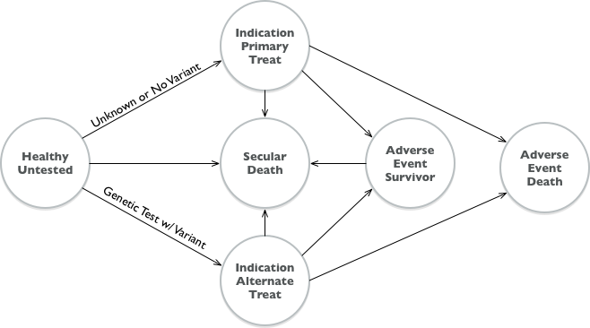

```{r setup, include=FALSE}
knitr::opts_chunk$set(echo = TRUE)
library(tidyverse)
library(tangram)
```

# Introduction

Decision analytic assessments of health policies and technologies play an important role in determining the availability, pricing and reimbursement of health care services worldwide. These assessments draw on a range of modeling methods to inform decision making from a variety of perspectives (e.g., societal, health system, patients, etc.).  Commonly used methods include decision trees, cohort and individual state transition (Markov) models, discrete event simulation (DES), systems dynamics models, and hybrid models that blend elements across approaches (e.g., Discretely Integrated Condition Event models) [@CaroDiscretelyintegratedcondition2016; @StahlModellingmethodspharmacoeconomics2008]. 

For a given health technology assessment or research question, best practice recommends basing the choice of modeling method on consultation with clinical, metholological, and policy experts [@CaroAdvantagesdisadvantagesdiscreteevent2016;@StahlModellingmethodspharmacoeconomics2008]. This ensures that the model accurately represents essential elements of the underlying disease or therapeutic processes, as well as the alternative decision(s) under consideration. 

In practice, however, considerations over model transparency, detail, ease of use, and even regulatory disclosure requirements also come into play. In addition, the application of Value of Information (VOI) methods may also guide model selection because the computational demands of VOI can be considerable [@jalal_gaussian_2018]. Thus, different modeling choices may be made depending on the relative weight placed on maximizing model transparency and resolution on the one hand, and on understanding parameter uncertainty to guide the scope and direction of future research on the other. 
 
Our objective for this study was to develop and compare three models of the same underlying therapeutic decision-making problem. In doing so, we provide replicable, open-source simulation code that crosswalks across three modeling approaches: cohort state transition (Markov) models,  discrete event simulation (DES), and time delay differential equations (DE). Importantly, these three models draw on an identical set of underlying parameters that should, we hypothesized, lead to equivalent (in expectation) cost and quality-adjusted life year (QALY) estimates and decision outcomes.  Our results demonstrate that under common situations (e.g., the use of tunnel states in Markov models) they do not. 

A key contribution of our study is the mathematical derivation of adjustment factors that must be applied to Markov models to produce equivalent model estimates as discrete event simulation or differential equations models.  These adjustments are necessary due to an interaction between competing risks and the coarsening of time into discrete cycles in a Markov model. Notably—-and somewhat counterintuitively—-neither half-cycle corrections (or its alternatives) or reducing the time cycle to continuous time will remove this source of bias in Markov models. We demonstrate that depending on the circumstances, these biases are not trivial and can lead to differences in decision-making that arise simply due to differences in model choice. 

# Methods

## Simple Pharmacogenomic Decision Scenario

Our models rely on an underlying structure derived from an application to our ongoing work in pharmacogenomics (PGx). PGx involves the use of genetic testing to guide drug selection and/or dosing based on known associations between genetic variants and drug metablolism. We have written on the cost-effectiveness and value of alterantive PGx strategies elsewhere [@graves_value_2018], though for our purposes here we  focus on a simple decision problem: whether to perform a genetic test to guide drug selection in a population at risk of developing an indication for a condition with a  standard maintenance medication therapy, but where there is a (more expensive and more effective) pharmacogenomic alternative available for individuals with a genetic variant. We compare a reference case scenario in which everyone who develops the condition receives the standard therapy to a PGx-guided scenario in which all individiuals with the condition receive a genetic test, and those with the varaint receive the more effective alternative therapy.

Details of the underlying PGx scenario are summarized below and in the model schematic figure:

- A population of 40-year old women is at risk for developing a condition (A) with a 10% incidence rate over a 10-year period. 

- All who develop condition A incur a one-time treatment cost of $10,000 ($2018), a transient one-year 0.05 utility decrement,  and are placed on daily maintenance medication ($0.50 / day) for life. 

- Individuals on the maintenance drug are at risk of a rare but serious adverse event (B) occuring with probability 0.02 over the first 1 year period. Event B has a 5% case fatality rate with a \$15,000 cost among the decedents and, among the survivors, incurs a one-time \$25,000 cost and a 0.1 disutility for life.

- There is a ($200) genetic test available that can identify individuals with a drug metabolism-associated variant (variant prevalance=20%). Individuals with the variant are placed on alternative maintenance medication that lowers the rate of event B (relative risk = 0.70), but costs \$5 / day. There is no change in the risk of adverse event B among individuals without the variant. 

- Events are not recurrent (i.e., an indiviudal can only experience up to 1 condition and 1 adverse event).

- Standard annual discounting of 0.03 applies. Prices are all in $2018. 



## Modeling Methods

We map the above scenario to three alternative models: a time delay differential equation model, a cohort state transition (Markov) model, and a discrete event simulation model. We briefly discuss each modeling method and the parameter mapping exercise here, though more detailed comparisons can be found in the published literature. 

### Time Delay Differential Equations 

### Cohort State Transition (Markov)

### Discrete Event Simulation

Discrete Event Simulation (DES) is a modeling methodology designed to incorporate the timing and interdependency of events [@KarnonModelingusingdiscrete2012;@CaroAdvantagesdisadvantagesdiscreteevent2016; @StandfieldMarkovmodelingdiscrete2014]. Though its origins are in industrial engineering and operations research, DES is increasingly used in health technology assessments [@StandfieldMarkovmodelingdiscrete2014; @JacobsonDiscreteeventsimulationhealth2006;@StahlModellingmethodspharmacoeconomics2008].

<!-- For example, in a DES it is straightforward to allow the probability of some future event to depend on the time spent in a given state (e.g., the probability of a pharmacogenomically-related adverse event declines as the amount of time spent on the drug increases). In addition, in cases where pharmacogenomic information informs the initial dosing of a drug (e.g., in the case of warfarin, which has received a great deal of pharmacogenomic attention), DES can readily accommodate the arrival rate of the genomic information. Such dynamics are difficult if not impossible to model using more standard Markov approaches (Caro and Möller 2016). -->

```{r, echo= FALSE}
source("../R/simple-params.R")
params %>% unlist() %>% data.frame() %>% 
  rownames_to_column() %>% 
  mutate(desc = as.character(params_lut[rowname])) %>% 
  select(3,2)# %>% 
  #tangram(., as.character=TRUE, style="lancet", caption="Model Parameters")
```


